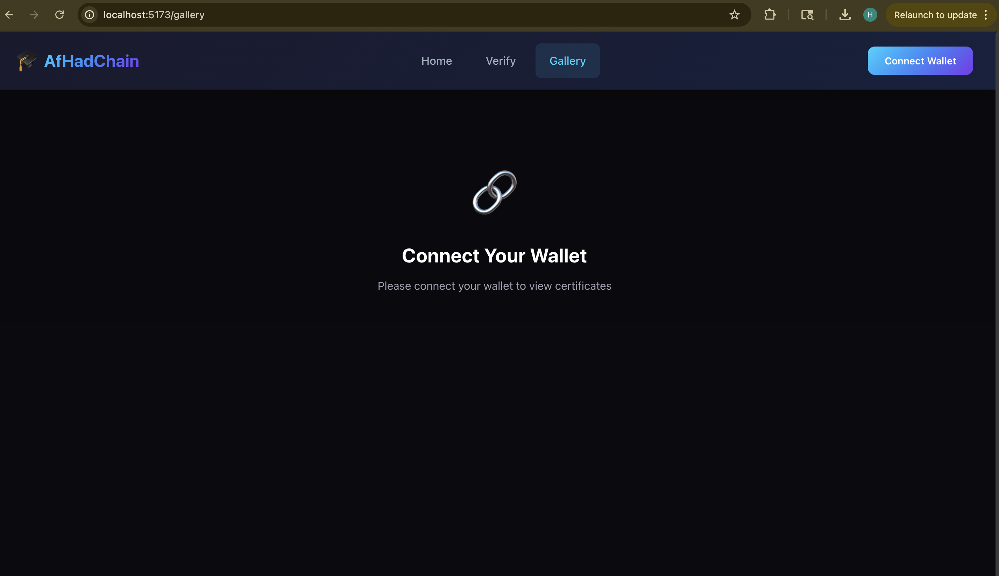
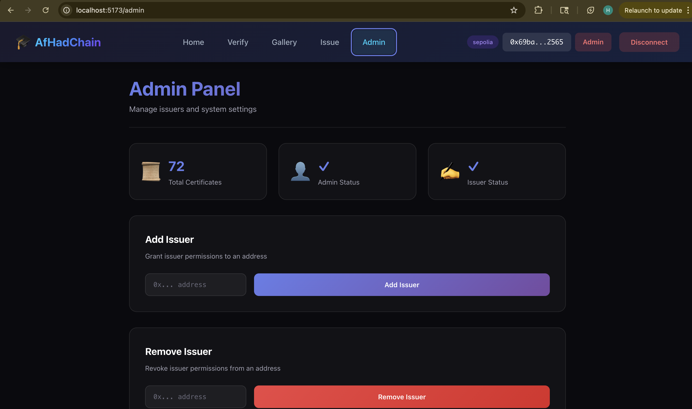
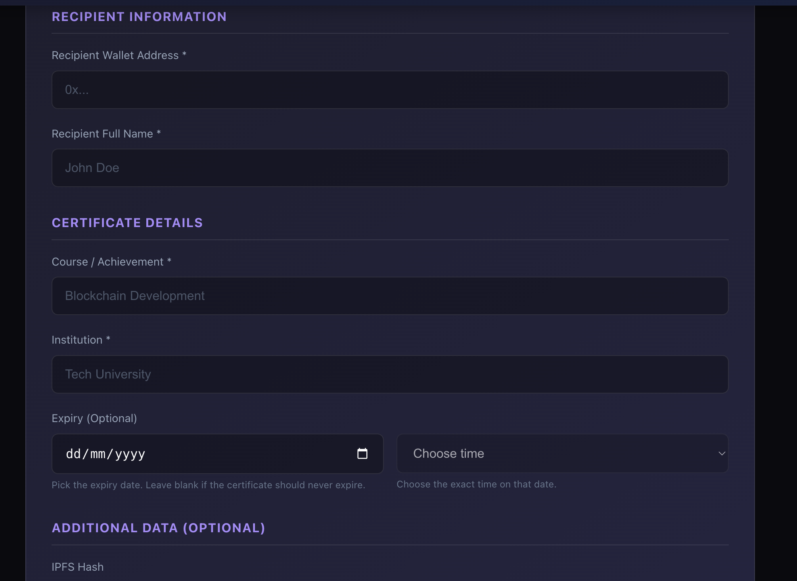
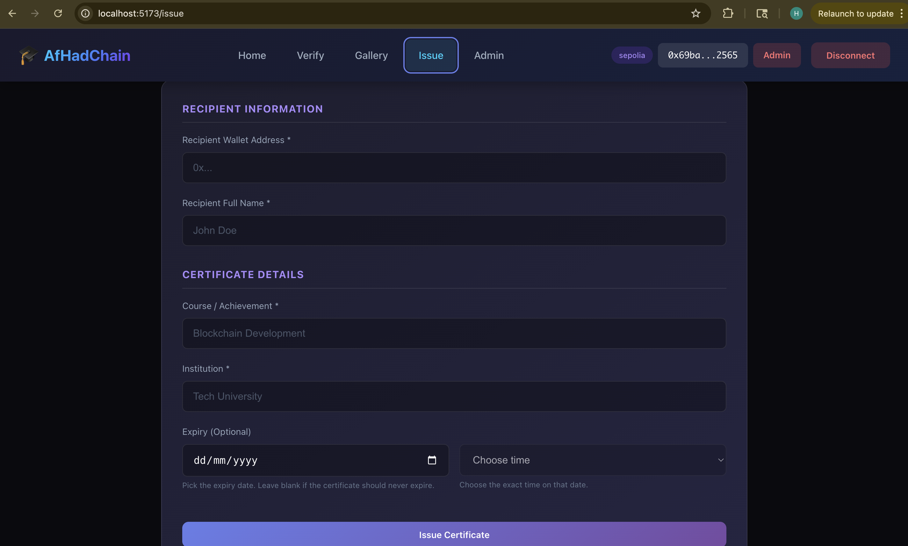
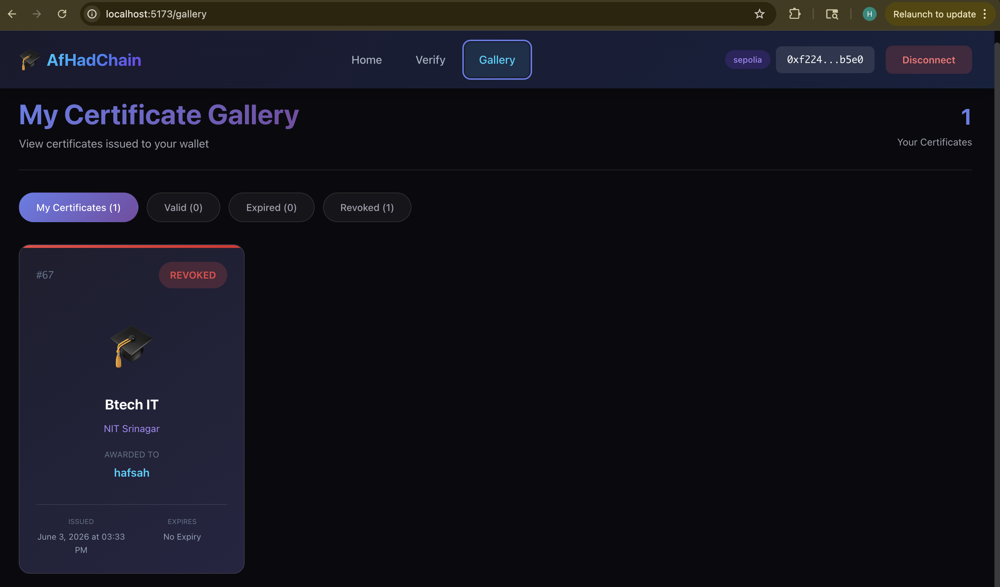

# 🎓 AfHadChain: Pure On-Chain Credential System

A fully decentralized credential management system built natively on the Ethereum blockchain. It eliminates third-party storage dependencies by storing 100% of certificate data on-chain. Built with Hardhat, Solidity, React, and ethers.js.

## ✨ Features

- **Issue Certificates** - Create tamper-proof digital certificates entirely on-chain without IPFS
- **Verify Certificates** - Instantly verify any certificate's authenticity, expiration, and revocation status
- **Verification Codes** - Generate a selective public verification code for every issued certificate
- **Dynamic Gallery View** - Browse all issued certificates visually rendered on the fly from raw blockchain data
- **Admin Panel** - Secure dashboard to manage authorized issuers and check access roles
- **Role-Based Access** - Strict Admin and Issuer roles prevent unauthorized entities from minting fake degrees
- **Revocation** - Authorized issuers and admins can revoke compromised certificates instantly

## 🛠️ Tech Stack

- **Smart Contract:** Solidity 0.8.20+, OpenZeppelin
- **Blockchain:** Hardhat (Ethereum)
- **Frontend:** React, Vite, TailwindCSS, ethers.js
- **Wallet:** MetaMask

## 📸 Project Screenshots

### 1. Main Dashboard


_The landing page welcoming users to connect with your specific wallet._

### 2. Admin Dashboard Overview


_The centralized control center restricted to system administrators for managing Issuing Authorities ._

### 3. Issuer Management (Add/Remove)


_The administrative interface for authorizing new university wallets or revoking existing institutional permissions._

### 4. Role Verification Tools


_A dedicated utility for inputting any cryptographic address to check its current access level (Admin, Issuer, or None)._

### 5. Issuance Interface Overview


_The main portal for authorized entities to prepare new academic credentials for secure on-chain deployment._

### 6. Certificate Configuration Fields


_The data entry form for defining recipient metadata, achievement names, institutional details, and optional expiration limits._

### 7. Administrative Records View


_An elevated gallery filter allowing administrators to monitor all smart contract activities, active tokens, and global history._

### 8. Authorized Issuer Portal


_The secure workspace tailored for verified academic institutions to sign transactions and distribute credentials._

### 9. Public Verifier Interface


_A global, wallet-free lookup page allowing anyone to instantly check a credential using its unique public verification code._

### 10. Expired Status Resolution


_The real-time interface indicating a certificate that has successfully passed validity verification but has crossed its preset calendar expiration timestamp._

### 11. Revoked Status Alert


_The critical cryptographic flag highlighting a certificate that has been intentionally cancelled and invalidated by its issuer or Admin ._

### 12. Valid Status Authentication


_The success screen displaying fully authenticated data, real-time contract confirmations, and absolute semantic validity directly from the Ethereum block._

## 📋 Prerequisites

- [Node.js](https://nodejs.org/) (v18 or higher)
- [MetaMask](https://metamask.io/) browser extension
- Git

## 🚀 Quick Start

### 1. Clone the Repository

```bash
git clone <your-repo-url>
cd afhadchain
```

### 2. Install Dependencies

```bash
# Install root dependencies
npm install

# Install frontend dependencies
cd frontend
npm install
cd ..
```

### 3. Start Local Blockchain (Terminal 1)

```bash
npx hardhat node
```

Keep this terminal running! You'll see 20 test accounts with 10,000 ETH each.

### 4. Deploy Smart Contract (Terminal 2)

```bash
npx hardhat run scripts/deploy.js --network localhost
```

You should see:

```text
✅ Certificate deployed to: 0x5FbDB2315678afecb367f032d93F642f64180aa3
```

### 5. Start Frontend (Terminal 3)

```bash
cd frontend
npm run dev
```

Frontend will be available at: `http://localhost:5173`

## 🦊 MetaMask Setup

### Add Hardhat Network

1. Open MetaMask
2. Click network dropdown → "Add Network" → "Add a network manually"
3. Enter:
   - **Network Name:** `Hardhat Local`
   - **RPC URL:** `http://127.0.0.1:8545`
   - **Chain ID:** `31337`
   - **Currency Symbol:** `ETH`
4. Click Save

### Import Test Account

1. In MetaMask, click account icon → "Add account or hardware wallet" → "Import account"
2. Paste this private key:
   ```text
   ac0974bec39a17e36ba4a6b4d238ff944bacb478cbed5efcae784d7bf4f2ff80
   ```
3. Click Import

> ⚠️ **Warning:** This is a TEST account with a PUBLIC private key. Only use it for local development!

This account is the **Admin/Issuer** and has 10,000 test ETH.

## 📖 Usage Guide

### Issue a Certificate

1. Connect wallet (must be Admin or Issuer)
2. Click "Issue" in navbar
3. Fill in certificate details:
   - Recipient Address
   - Recipient Full Name
   - Course (Achievement)
   - Institution Name
   - Expiry Date (Optional)
4. Click "Issue Certificate"
5. Confirm in MetaMask

### Verify a Certificate

1. Click "Verify" in navbar
2. Enter the verification code
3. Click "Verify"
4. See verification result and certificate details

### View All Certificates

1. Click "Gallery" in navbar
2. Browse all certificates dynamically rendered from the blockchain
3. Filter by: All, My Certificates, Valid, Expired, Revoked
4. Click any certificate for full details

### Admin Functions

1. Click "Admin" in navbar (only visible to admins)
2. Add/Remove issuers
3. Check role status of any address

## 📁 Project Structure

```text
afhadchain/
├── contracts/
│   └── Certificate.sol        # Main smart contract (ERC721 + RBAC)
├── scripts/
│   └── deploy.js              # Local & Testnet deployment script
├── frontend/
│   ├── src/
│   │   ├── components/        # UI Components (Navbar, Cards)
│   │   ├── pages/             # Pages (Home, Issue, Verify, Gallery, Admin)
│   │   └── config/            # Contract ABI & deployed address
│   └── package.json
├── hardhat.config.js          # Hardhat network & compiler configuration
└── package.json
```

## 🔧 Smart Contract Functions

| Function                         | Description                                                 |
| -------------------------------- | ----------------------------------------------------------- |
| `issueCertificate()`             | Issue a new certificate NFT with a public verification code |
| `verifyCertificateByCode()`      | Verify certificate validity by public verification code     |
| `getTokenIdByVerificationCode()` | Resolve a verification code to a token ID                   |
| `verifyCertificate()`            | Verify certificate validity                                 |
| `revokeCertificate()`            | Revoke a certificate                                        |
| `getCertificateDetails()`        | Get full certificate data                                   |
| `addIssuer()`                    | Add a new issuer (admin only)                               |
| `removeIssuer()`                 | Remove an issuer (admin only)                               |

## 🌐 Deploying to Testnet (Optional)

1. Create `.env` file:

   ```text
   SEPOLIA_RPC_URL=your_rpc_url
   SEPOLIA_PRIVATE_KEY=your_private_key
   ```

2. Deploy:

   ```bash
   npx hardhat run scripts/deploy.js --network sepolia
   ```

3. Update contract address in `frontend/src/config/contract.js`

## 🤝 Authors

**Hadiya Mushtaq** & **Afrah Javid** Developed as an End-Semester Final Project at the National Institute of Technology (NIT) Srinagar, Department of Computer Science and Engineering.

---

Built with ❤️ using Hardhat, React, and Solidity
